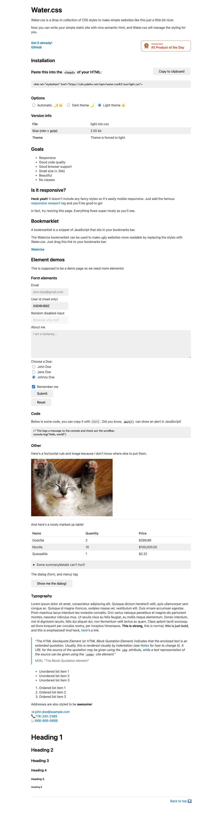

Classless CSSフレームワーク、またはNo-Class CSSフレームワークとは、HTMLのクラスを記述しないで、素のHTMLだけを記述します。

プロトタイピングやデモサイトなど、簡単なサイトを素早く構築できます。

Next.jsでも簡単に導入でき、すぐに使えるClassless CSSフレームワークを紹介します。

## Water.css

まず、キャプチャをみていただくのが早いです。



※クリックして別ウィンドウで拡大表示できます。

このようなページを一切クラスを書くことなく作成できます。

ライト/ダークモードのどちらか、ユーザーの環境にあわせて自動でライト/ダークを切替る、3つのテーマから選べます。

Next.jsで使うのは簡単です。`styles/globas.css`を使いたいテーマのCSSのURLに書き換えるだけです。

```css
@import url("https://cdn.jsdelivr.net/npm/water.css@2/out/water.css")
```

コードや詳細はGitHubページより参照してください。

<LinkCard href="https://github.com/kognise/water.css" />

## MVP.css

次に紹介する、MVP.cssはランディングページのようなイメージのページを作成できます。


※クリックして別ウィンドウで拡大表示できます。

Wataer.cssと同様に、`styles/globas.css`を以下に書き換えれば使用できます。

```css
@import url("https://unpkg.com/mvp.css")
```

コードや詳細はGitHubページより参照してください。

<LinkCard href="https://www.github.com/andybrewer/mvp/" />

## Basic.css

Basic.cssもシンプルなサイトをつくる事ができます。


※クリックして別ウィンドウで拡大表示できます。

npmで配布されているので、`npm`でインストールします。

```sh
$ npm install @vladocar/basic.css
```

`pages/_app.js`で`import`して利用できます。

```js
import '@vladocar/basic.css'
```

詳細は下記を参照してください。

<LinkCard href="https://github.com/vladocar/Basic.css" />

## @stackhackerio/classless

以上紹介したもので、シンプルで見栄えのするサイトを作成できますが、さらにベースのデザインからもう少しカスタマイズしたいというときに、便利なClasslessCSSのパッケージを紹介します。

`@stackhackerio/classless`はTailwindcssのプラグインなので、Tailwindcssのユーティリティでカスタマイズできます。


※クリックして別ウィンドウで拡大表示できます。

導入には、まずNextjsにTailwindcssがセットアップした状態にします。

<LinkCard href="https://tailwindcss.com/docs/guides/nextjs" />

必要なパッケージ類をいれます。

```sh
npm install --save-dev @tailwindcss/forms @tailwindcss/typography @stackhackerio/classless
```

`tailwind.config.js`にpluginを追加します。

```js
plugins: [
  require('@tailwindcss/typography'),
  require('@tailwindcss/forms'),
  require('@stackhackerio/classless'),
],
```

詳細は下記を参照してください。

<LinkCard href="https://github.com/stackhackerio/classless" />

## おわりに

ちょっとしたサイトを作るのに、Classless CSSフレームワークはHTMLを記述するだけなので便利です。

`@stackhacker/classless`をすぐ使えるようにスターターをご用意したのでご活用ください。

<LinkCard href="/starters/quicko" />
