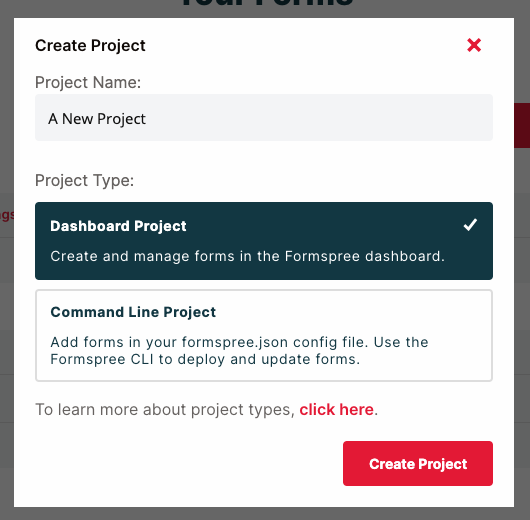
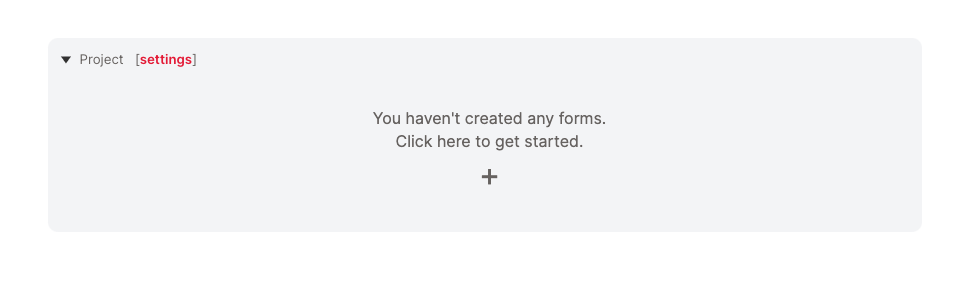
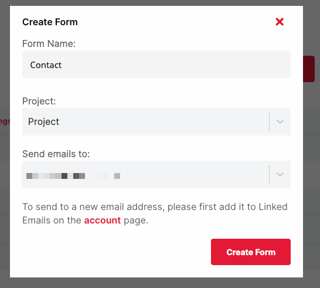
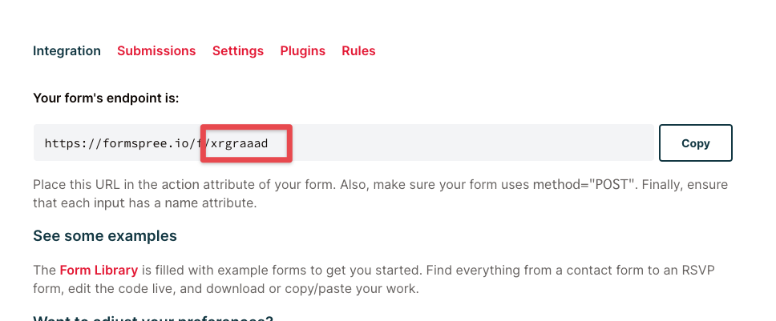
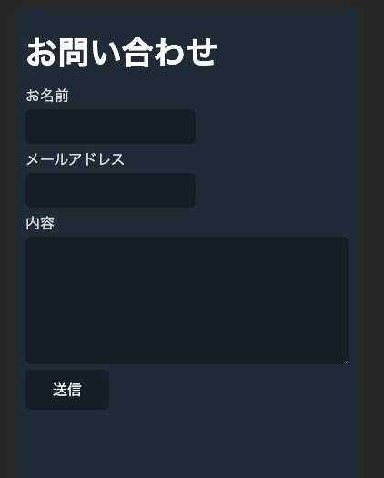
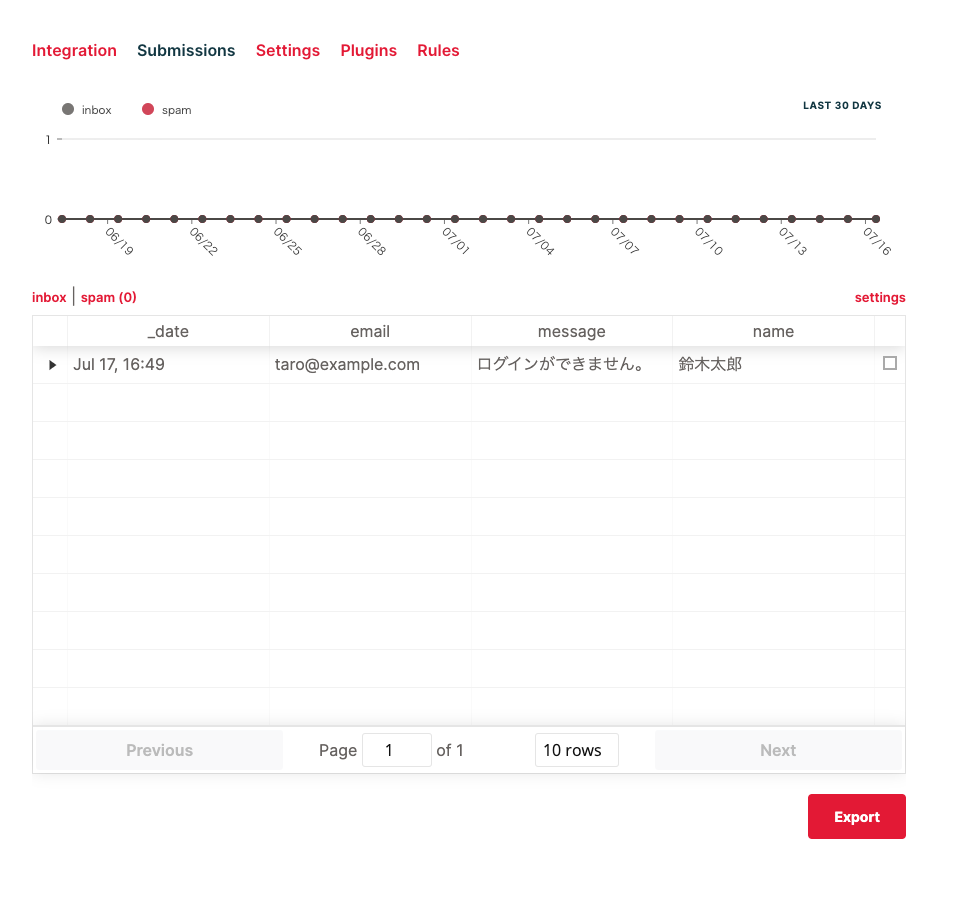

ブログサイトなどをNext.jsで構築してVercelにデプロイした際、お問い合わせフォームを処理したいときがあります。

その際、Formspreeがお手軽に実現できるアプローチとして便利です。今回は設置までの手順をご紹介します。

## Formspree

まず、アカウントのサインアップをします。

<LinkCard href="https://formspree.io/" />

サインインして、ダッシュボードの**+ New Project**ボタンをクリックして、新しくプロジェクトを作成します。



**Project Name**にプロジェクト名を入力して、**Dashboard Project**がデフォルトで選択されている状態で、**Create Project**をクリックしてプロジェクトを作成します。



フォーム一覧に、新しく作成したプロジェクトが表示されるので、**+**ボタンをクリックして、フォームを作成します。



**Form Name**にフォーム名を入力します。ここでは**Contact**とします。**Project**はそのままで、**Send emails to**は、フォームが投稿されたら通知する送信先のメールアドレスを選択します。

**Create Form**をして、新しくフォームを作成します。



エンドポイントの情報が表示されるので、赤枠で囲ったIDを控えておきます。

## Next.js

次に、Next.jsサイトを作成します。

```shell {filename: shell}
npx create-next-app --use-npm formspree
```

Formspreeが提供しているReact用のプラグインをインストールします。

```shell {filename: shell}
npm install @formspree/react
```

フォームの体裁を整えるのに、前回の記事で紹介した、Water.cssを使用します。

<LinkCard href="/posts/classless" />

`styles/globals.css`を下記に書き換えます。

```css {filename: styles/globals.css}
@import url("https://cdn.jsdelivr.net/npm/water.css@2/out/water.css")
```

`pages/contact.js`というファイルを作成して、フォームを作成します。

```jsx {lineNum}{filename: pages/contact.js}
import { useForm } from "@formspree/react";

export default function Contact() {
  const [state, handleSubmit] = useForm("[id]");

  if (state.succeeded) {
    return <p>お問い合わせありがとうございます。</p>;
  }

  return (
    <>
      <h1>お問い合わせ</h1>
      <form onSubmit={handleSubmit}>
        <label htmlFor="name">お名前</label>
        <input id="name" type="text" name="name" required={true} />
        <label htmlFor="email">メールアドレス</label>
        <input id="email" type="email" name="email" required={true} />
        <label htmlFor="message">内容</label>
        <textarea id="message" name="message" required={true} />
        <button type="submit" disabled={state.submitting}>
          送信
        </button>
      </form>
    </>
  );
}
```

4行目の`useForm("[id]")`の`[id]`に先ほど控えた、FormspreeのエンドポイントのID部分で書き換えます。

ローカルでサーバーを立ち上げます。

```shell {filename: shell}
npm run dev
```

ブラウザでコンタクトページにアクセスします。

http://localhost:3000/contact



適当に何か入力して、**送信**をします。



送信された内容は、Formspreeのダッシュボードの**Submissions**タブで確認できます。

## おわりに

Formspreeは簡単に設置でき、Slackに通知したり、他のサービスとの連携が設定でできるようになるので便利です。

ランディングページとセットになった、スターターをご用意したので、ぜひご活用ください。

<LinkCard href="/starters/aspree" />
