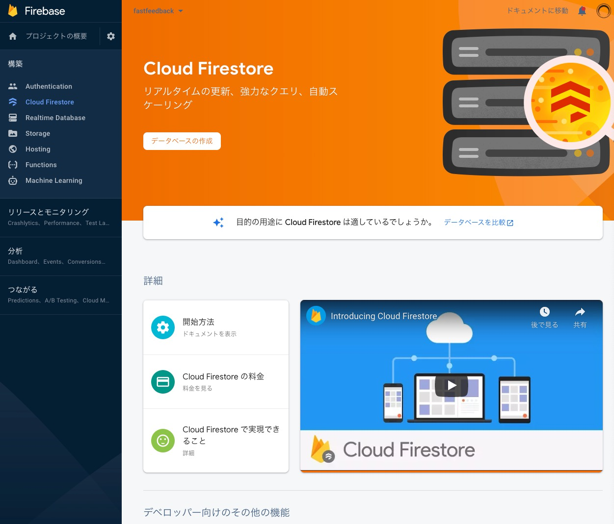

プロダクトを構築する際に、たくさんの技術的な選択肢がありすぎて、どの技術を使うのかよく悩みます。

JavascriptのフレームワークはReactがいいのか、それともVue.js？また、バックエンドは、FirebaseかAWS？技術スタックの選択は悩みがつきません。

そのような背景で、React2025というサイトが非常に参考になりました。

<LinkCard href="https://react2025.com" />

「2025年にいるかのような気分でウェブサイトの開発をはじめましょう」をうたい文句にしており、このコースで作成したサービスも実際に稼働しています。

このコースを参考に、Next.jsとFirebaseで認証の仕組みを構築するパートを複数回に分けてご紹介します。

Next.jsでFirebaseを使ってGitHubアカウントでログインができるようにします。

最初の回は、FirebaseとGitHubをセットアップしていきます。

## Firebaseのセットアップ

FirebaseはGoogle Cloud上で利用できるBaaSです。ここでは、ソーシャルメディアのアカウントでログインできるようにするための認証をFirebaseAuthenticationを使い、ユーザーの情報を保存するたにCloud Firestoreを使用します。

### プロジェクトの作成

プロジェクトをFirebaseのコンソールから作成します。

**プロジェクトを作成**をすると、ウィザードが開始するので、下記の通りに設定します。

- 手順1: プロジェクト名を`fastfeedback`
- 手順2: Google Analyticsを有効にしない

手順を簡略化するため、ここではGoogle Analyticsを省略します。

しばらくすると、プロジェクトのダッシュボードを確認できます。

### Cloud Firestoreのセットアップ

続いて、Cloud Firestoreをセットするために、ダッシュボードから**Cloud Firestore**を開きます。

**データベースの作成**をすると、データベース作成のためのウィザードが開くので、下記を設定して作成します。

- Cloud Firebaseのセキュリティー保護ルール： テストモードで開始する
- Cloud Firebaseのロケーション： asia-northeast1

### 認証情報

Next.jsからFirebaseに接続するための認証情報を保持します。

まず、サイドメニューにある**プロジェクト画の概要**の横にある歯車をクリックして、**プロジェクトを設定**を選択します。

**マイアプリ**欄からウェブアプリ（</\>）を選択します。

**アプリのニックネーム**に適当な名称をいれて、アプリを登録します。ここでは、***web**とします。

登録が完了すると、スクリプトが表示されます。後ほど必要になるので、`firebaseConfig`の値を保持しておきます。

## GitHub認証のセットアップ

GitHubで認証できるようにセットアップしていきます。

まず、Fibaseコンソールで下記の手順に従って、コールバックURLを取得します。

- サイドバーの**Authentication**を開く
- [Sign-in method]タブを開く
- [GitHub]をクリック

コールバックURLをコピーして、GitHub側に設定していきます。

- GitHubにログインしている状態で[こちら](https://github.com/settings/applications/new)から認証の登録画面を開く
- [Application name]にアプリの名称（例えば、[fastfeedback]など）を入力
- [Homepage URL]にホームページURL（まだない場合は、適当に有効なURL、`http://localhost`など）を入力
- [Application description]にアプリの概要を任意で入力
- [Authorization callback URL]に先ほどコピーしたコールバックURLを入力
- [Register application]ボタンをクリックして登録

登録ができると、アプリの設定画面が開くので、[Generate a new client secret]をして、クライアントシークレットを生成します。

先ほどの、Firebaseコンソールに戻ります。

**有効にする**トグルをオンにすると、各欄に入力できるようなります。GitHubの情報を入力します。

- **Client ID**を**クライアントID**欄に入力
- **Client secret**を**クライアントシークレット**欄に入力

**保存**ボタンをクリックして、GitHub認証を有効にします。

## おわりに

Firebase AutheticationでGitHub認証ができるようになりました。次回はNext.jsのセットアップをします。

<LinkCard href="/posts/nextjs-firebase-auth-2" />

