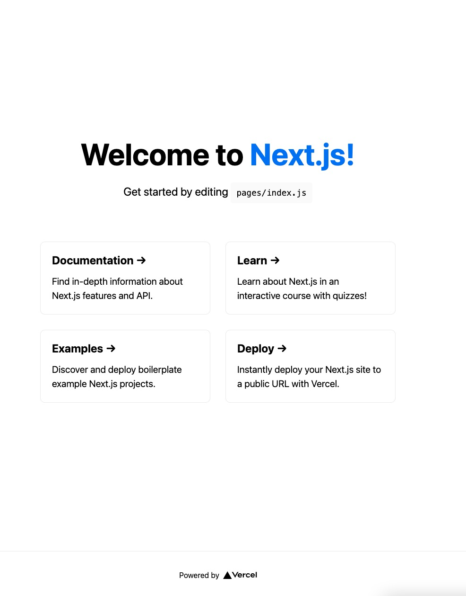

前回の記事で、Firebase Authenticationのセットアップをしました。

<LinkCard href="/posts/nextjs-firebase-auth-1" />

今回はNext.jsでFirebaseに接続できるように準備をします。

## Next.jsのセットアップ

`yarn`を使って、Next.jsのプロジェクトを生成します。

```shell {filename: shell}
yarn create next-app
```

"What is your project named?"と聞かれるので、ここでは`fastfeedback`と入力します。

```shell {filename: shell}
cd fastfeedback
yarn dev
```

プロジェクトディレクトリーに移動して、サーバーを起動をします。

ブラウザーで以下のURLに接続します。

http://localhost:3000

ウェルカムページを確認できます。



## Firebase クライアントを追加

### SDKのインストール

FirebaseクライアントのSDKをインストールします。先ほど作成したプロジェクトディレクトリで`yarn`を実行します。

```shell {filename: shell}
yarn add firebase@7.17.1
```

ここでは、Firebaseの最新版では問題があるため、v7.17.1を使用します。

### 環境変数

Next.jsには環境変数をサポートするための仕組みが組み込まれています。Firebaseに接続するための機密情報をgitにコミットしたくないので、環境変数を使う必要があります。

Next.jsで環境変数を追加するには、`.env`と`.env.local`ファイルを作成します。

`.env`には任意の環境変数を入れることができます。使用する環境変数に空の値を入れた状態にしておくことで、使用する環境変数がわかるので便利です。このファイルはコミットします。

`.env.local`には実際の機密情報を入力して、このファイルはコミットしないようにします。先ほど、プロジェクトを生成した際、すでに`.gitignore`にそのような設定がされています。

実際の値は違いますが、記述は下記のようにします。

```env {filename: .env}
NEXT_PUBLIC_FIREBASE_API_KEY=
NEXT_PUBLIC_FIREBASE_AUTH_DOMAIN=
NEXT_PUBLIC_FIREBASE_PROJECT_ID=
```

```env {filename: .env.local}
NEXT_PUBLIC_FIREBASE_API_KEY=AIzaSyCes_HM5fdsJOU352-asdf253HKsd
NEXT_PUBLIC_FIREBASE_AUTH_DOMAIN=your-app-1j324.firebaseapp.com
NEXT_PUBLIC_FIREBASE_PROJECT_ID=your-app-1j324
```

環境変数に`NEXT_PUBLIC_`接頭子をつけることによって、Next.jsアプリケーションのクライアントサイドで参照できるようになります。詳細は、[こちら](https://nextjs.org/docs/basic-features/environment-variables#exposing-environment-variables-to-the-browser)を参照してください。

実際の値は、前回の記事で取得した`firebaseConfig`の値を参考に記述します。

- `NEXT_PUBLIC_FIREBASE_API_KEY` : `apiKey`
- `NEXT_PUBLIC_FIREBASE_AUTH_DOMAIN` : `authDomain`
- `NEXT_PUBLIC_FIREBASE_PROJECT_ID` : `projectId`

## Firebaseクライアント

これで安全にFirebaseに接続できます。新しいファイル`lib/firebase.js`を作成して、アプリケーションを初期化し、接続できるようにします。接続をできるようにする必要があるのは、最初に読み込まれたときだけにするために、`if`文を使用します。

```js {filename: lib/firebase.js}
import * as firebase from 'firebase/app';
import 'firebase/auth';
import 'firebase/functions';
import 'firebase/firestore';

if (!firebase.apps.length) {
  firebase.initializeApp({
    apiKey: process.env.NEXT_PUBLIC_FIREBASE_API_KEY,
    authDomain: process.env.NEXT_PUBLIC_FIREBASE_AUTH_DOMAIN,
    projectId: process.env.NEXT_PUBLIC_FIREBASE_PROJECT_ID
  });
}

export default firebase;
```

## おわりに

Next.jsからFirebaseに接続するための準備ができました。次回は、実際にGitHubでサインインできるように認証の処理を実装します。

<LinkCard href="/posts/nextjs-firebase-auth-3" />

## 参考

本記事は下記の内容を一部抜粋して、日本語環境で実行するための補足をして紹介しています。

<LinkCard href="https://react2025.com" />
