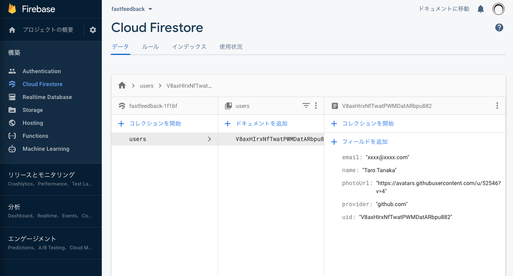
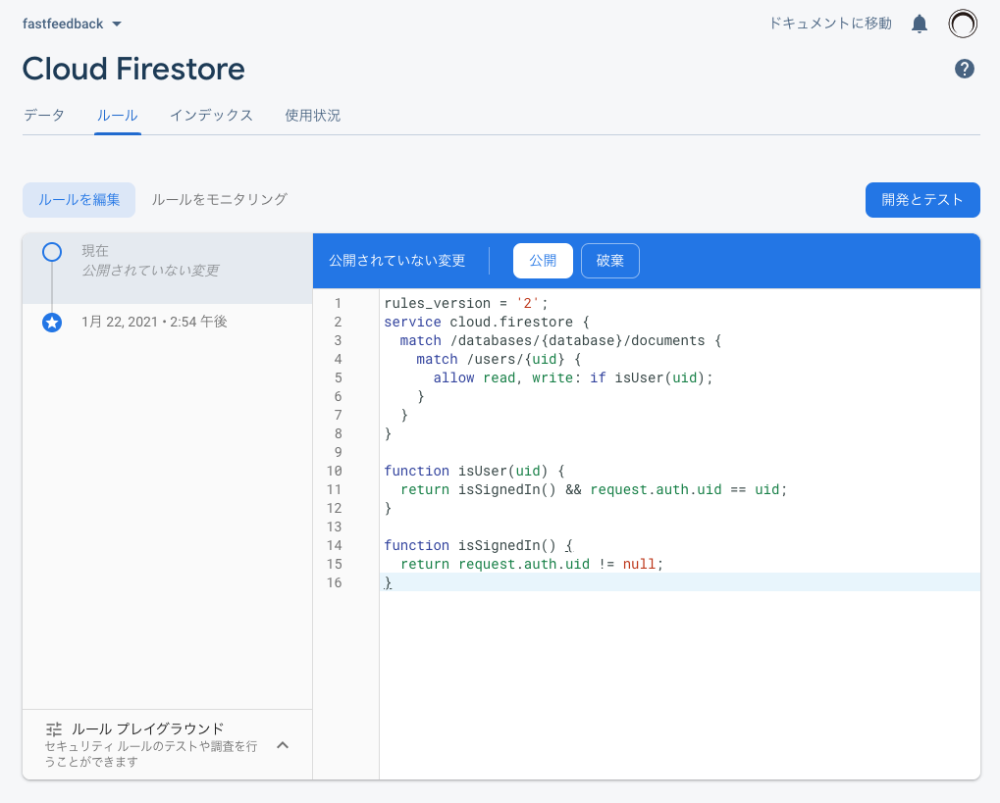
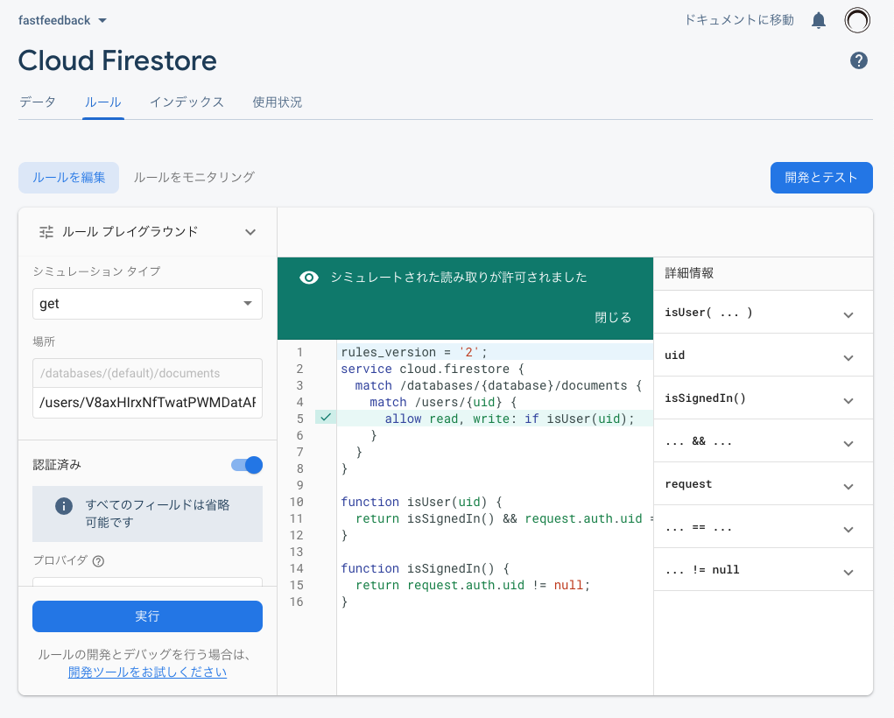

前回Next.jsでFirebase Authentication を使って、GitHubアカウントでサインインできるようになりました。

https://stackhacker.io/nextjs-firebase-auth-3

Firebase Authentication では、ユーザーに関する情報を追加できません。そのため、Cloud Firestore を使ってユーザーの情報を保存します。

ここでは、GitHubから取得した、名前やメールアドレスを保存します。

## ユーザーの作成

データベースに対して新規作成するため、`lib/db.js`という新しいファイルを作成します。

`lib/db.js`

```jsx
import firebase from './firebase'

const firestore = firebase.firestore()

export function createUser(uid, data) {
  return firestore
    .collection('users')
    .doc(uid)
    .set({ uid, ...data }, { merge: true })
}
```

## 認証フックを更新

`useAuth`フックの中で`createUser`関数を使用します。

`lib/auth.js`

```jsx {3,22}
import React, { useState, useEffect, useContext, createContext } from 'react'
import firebase from './firebase'
import { createUser } from './db'

const authContext = createContext()

export function AuthProvider({ children }) {
  const auth = useProvideAuth()
  return <authContext.Provider value={auth}>{children}</authContext.Provider>
}

export const useAuth = () => {
  return useContext(authContext)
}

function useProvideAuth() {
  const [user, setUser] = useState(null)

  const handleUser = (rawUser) => {
    if (rawUser) {
      const user = formatUser(rawUser)
      createUser(user.uid, user)
      setUser(user)
      
      return user
    } else {
      setUser(false)

      return false
    }
  }

  const signinWithGitHub = () => {
    return firebase
      .auth()
      .signInWithPopup(new firebase.auth.GithubAuthProvider())
      .then((response) => handleUser(response.user))
  }

  const signout = () => {
    return firebase
      .auth()
      .signOut()
      .then(() => handleUser(false))
  }

  useEffect(() => {
    const unsubscribe = firebase.auth().onAuthStateChanged(handleUser)

    return () => unsubscribe()
  }, [])

  return {
    user,
    signinWithGitHub,
    signout,
  }
}

const formatUser = (user) => {
  return {
    uid: user.uid,
    email: user.email,
    name: user.displayName,
    provider: user.providerData[0].providerId,
    photoUrl: user.photoURL,
  }
}
```

前回の記事から、ハイライトした行を追加します。

## 保存したデータを確認

サインインしている場合は、一度サインアウトしてから、サインインします。

Firebase Consoleでユーザーが新規作成されていることを確認できます。



## ルールを編集

ただ、このままだと誰か他のユーザーの情報を編集したり追加できてしまいます。そのためにルールを追加して、ユーザーは、自分の情報しか編集できないようにします。

**ルール**タブを選択して、以下のルールにします。

```
rules_version = '2';
service cloud.firestore {
  match /databases/{database}/documents {
    match /users/{uid} {
      allow read, write: if isUser(uid);
    }
  }
}

function isUser(uid) {
  return isSignedIn() && request.auth.uid == uid;
}

function isSignedIn() {
  return request.auth.uid != null;
}
```

**公開**ボタンをクリックして、ルールを有効にします。



ユーザーが自分の情報を見られるか確認しましょう。

**ルールプレイグラウンド**を使います。開いたら、実際の値は先ほどのユーザー情報を参照して、下記を参考に入力します。

* シミュレーションタイプ： get
* 場所： /users/V8axHIrxNfTwatPWMDatARbpu882
* 認証済み： トグルをオン
* プロバイダー： GitHub
* Firebase UID： V8axHIrxNfTwatPWMDatARbpu882

**実行**をします。



自分の情報への読み取りは許可されていることが確認できました。逆に**Firebase UID**を適当な値に変更して見られないことも確認しましょう。

## おわりに

Next.jsで構築したアプリケーションに、GitHubアカウントで認証ができるようになりました。

全前記事を通して、やったことをまとめます。

* Firebaseで新規プロジェクトを作成し、Firebase Authenticationと Cloud Firestoreを設定しました。
* GitHubアプリケーションを作成して、ユーザーがサインインできるようにしました。
* アプリケーションはクライアント側でFirebaseとやりとりできるように設定しました。
* `useAuth`を使ってサインイン、サインアウト、ユーザー情報へのアクセスができるようになりました。
* ユーザーがアプリケーションにログインすると、その情報がFirestoreのユーザーテーブルに保存されます。
* アプリケーションのセキュリティーを確保するために、クライアント側の操作のためのセキュリティールールを定義しました。

## 参考

本記事は下記の内容を一部抜粋して、日本語環境で実行するための補足をして紹介しています。

https://react2025.com
