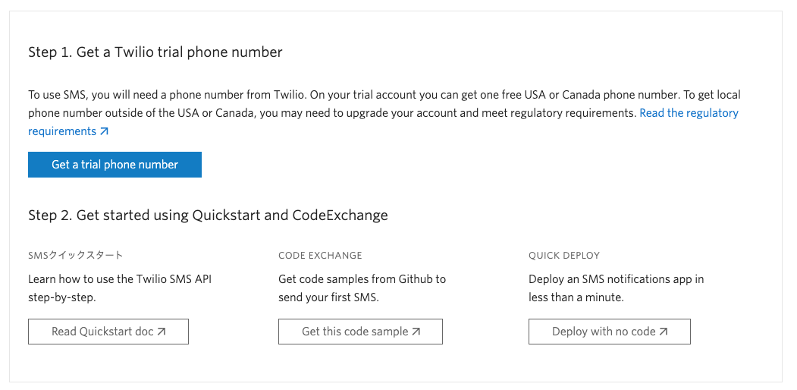
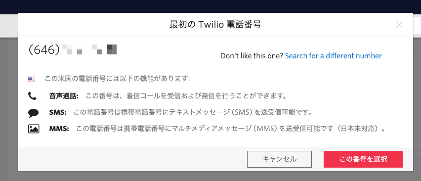
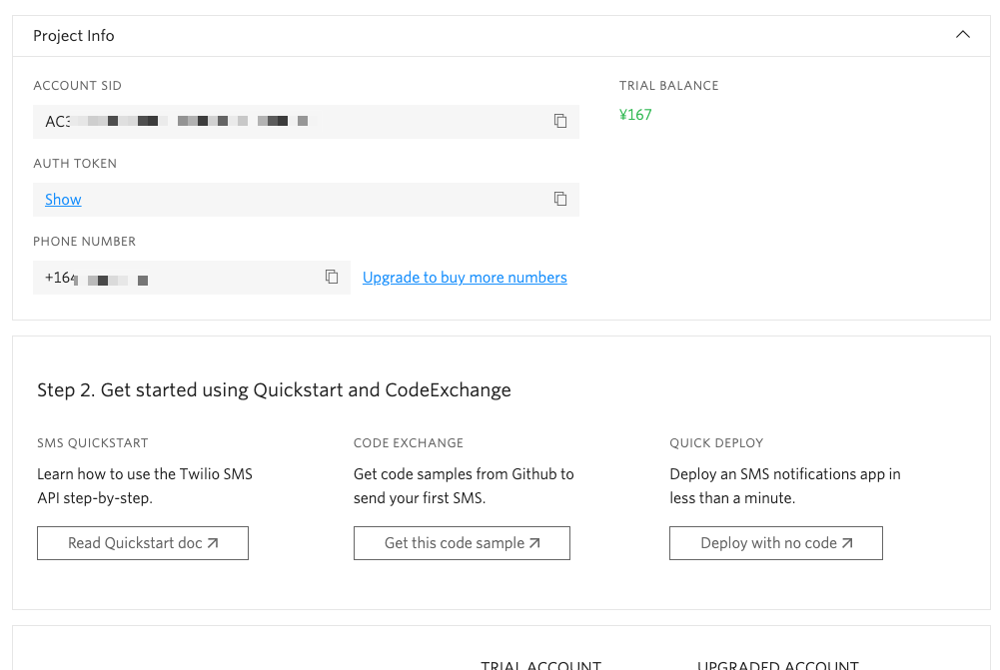
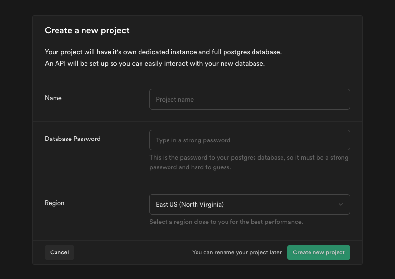
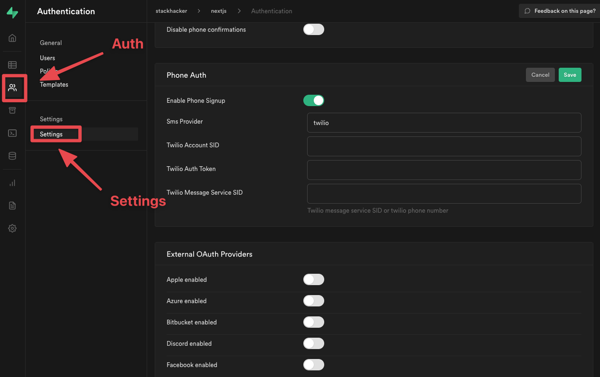
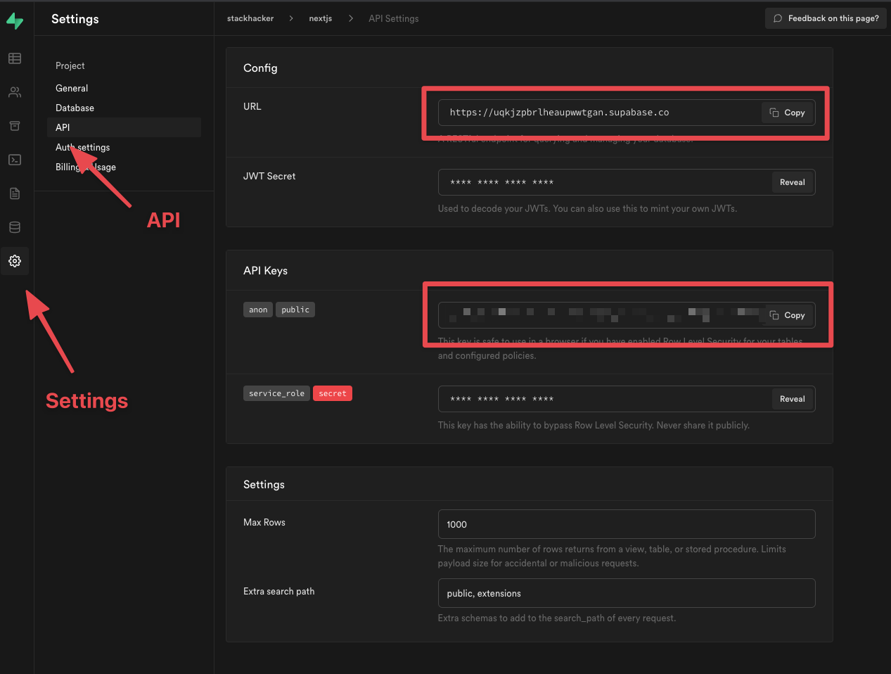

前回の記事で、Supabaseを使って、マジックリンクでサインインできるようにしました。

<LinkCard href="https://www.stackhacker.io/posts/supabase-nextjs-quickstart" />

先週、Supabase のAuth v2が発表され、新しくSMS認証もサポートされました。

<LinkCard href="https://supabase.io/blog/2021/07/28/supabase-auth-passwordless-sms-login" />

今回は、その新しい機能を使って、Next.js で、SMS認証を使ったアプリを構築する手順を紹介します。

## Twilioのセットアップ

現状、Supabaseで対応しているSMSプロバイダーはTwilioだけなので、Twilioを使用していきます。

Twilioのアカウントをお持ちでない場合は、サインアップをします。無料サインアップがあるので、そちらをご活用ください。

<LinkCard href="https://www.twilio.com/ja/" />

SMS送信をするための電話番号が必要になります。今回はじめてサインアップした場合は、ダッシュボードに「Step1. Get a Twilio trial pbone number」と表示されているので、「Get a trial phone number」ボタンをクリックして、電話番号を取得します。



電話番号の一覧が表示されるので、一覧からどれか電話番号を選択すると、電話番号の詳細が表示されるので、「この番号を選択」します。



ダッシュボードで認証情報を確認することができるようになります。



これらの情報は後ほどSupabaseをセットアップする際に使用します。

## Supabaseプロジェクトのセットアップ

Supabaseで新しくプロジェクトを作成します。

### プロジェクトを作成

プロジェクトの作成するために、以下の手順をします。

1. [app.supabase.io](https://app.supabase.io)にアクセス
1. 「New Project」をクリック
1. プロジェクトの詳細を入力



「Name」にプロジェクトの名称、「Database Password」にデータベース接続に使用するパスワードを入力します。「Region」には想定ユーザのネットワークに近いリージョンを選択します。ここでは、「Northeast Asia (Tokyo)」を選択します。

「Create new project」をクリックして、新しくプロジェクトが作成されるまでしばらく待ちます。

### 認証の設定

サイドメニューから「Auth」を選択して、「Settings」を開いて設定画面を開きます。

「Phone Auth」という欄があるので、トグルををオンにして、Twilioの情報を入力します。



先ほどのTwilioの「Project Info」でコピーした内容をそれぞれ入力して、「Save」ボタンをクリックして保存します。

### APIキーの取得

APIの設定から、URLと`anon`キーを取得します。

1. 「Settings」セクションに移動
2. サイドバーにある「API」をクリック



API URLとanonキーを確認します。後ほどアプリで使用します。

## Next.jsアプリの構築

### 初期化

[`create-next-app`](https://nextjs.org/docs/getting-started)を使って、新しくアプリ作成します。

```shell {filename: shell}
npx create-next-app --use-npm supabase-nextjs-otp
cd supabase-nextjs-otp
```

次に、必要なパッケージををインストールします。

```shell {filename: shell}
npm install @supabase/supabase-js
```

最後に、環境変数を `.env.local` に保存します。APIのURLと、先ほど保持した`anon`キーをセットします。

```bash {filename: .env.local}
NEXT_PUBLIC_SUPABASE_URL=SUPABASEのURL
NEXT_PUBLIC_SUPABASE_ANON_KEY=SUPABASEのANONキー
```

APIの認証情報で、Supabaseクライアントを初期化するヘルパーファイルを作成します。

```js {filename: lib/supabaseClient.js}
import { createClient } from '@supabase/supabase-js'

const supabaseUrl = process.env.NEXT_PUBLIC_SUPABASE_URL
const supabaseAnonKey = process.env.NEXT_PUBLIC_SUPABASE_ANON_KEY

export const supabase = createClient(supabaseUrl, supabaseAnonKey)
```

### スタイルシート

アプリの見た目を整えるために、CSSファイルを作成します。

行数が多いので、[こちら](https://raw.githubusercontent.com/stackhackerio/stackhacker.io/main/examples/supabase-nextjs-otp/styles/globals.css)より、ダウンロードしてください。

ダウンロードしたファイルで`styles/globals.css`を上書きします。

### 認証コンポーネント

電話番号を入力して、SMSで送信された6桁のワンタイム・パスワードを入力して認証できるようにします。

まず先に、6桁のワンタイム・ワスワードを入力するコンポーネントを作成します。

```jsx {filename: components/Verify.js}
import { useState } from 'react'
import { supabase } from '../lib/supabaseClient'

export default function Verify({ phone }) {
  const [loading, setLoading] = useState(false)
  const [token, setToken] = useState('')

  const handleVerify = async ({ token }) => {
    try {
      setLoading(true)
      const { error } = await supabase.auth.verifyOTP({
        phone,
        token,
      })
      if (error) throw error
    } catch (error) {
      alert(error.error_description || error.message)
    }
  }

  return (
    <div className="row flex flex-center">
      <div className="col-6 form-widget">
        <h1 className="header">Supabase + Next.js</h1>
        <p className="description">
          SMSに送信された6桁のワンタイムパスワードを入力してください
        </p>
        <div>
          <input
            className="inputField"
            type="text"
            placeholder="ワンタイムパスワード"
            value={token}
            onChange={(e) => setToken(e.target.value)}
          />
        </div>
        <div>
          <button
            onClick={(e) => {
              e.preventDefault()
              handleVerify({ token })
            }}
            className="button block"
            disabled={loading}
          >
            <span>{loading ? 'ローディング...' : '送信する'}</span>
          </button>
        </div>
      </div>
    </div>
  )
}
```

次に、電話番号を入力して、6桁のワンタイム・パスワード入力のコンポーネントに遷移するコンポーネントを作成します。

```jsx {filename: components/Auth.js}
import { useState, useEffect } from 'react'
import { supabase } from '../lib/supabaseClient'
import Verify from './Verify'

export default function Auth() {
  const [loading, setLoading] = useState(false)
  const [phone, setPhone] = useState('')
  const [password, setPassword] = useState('')
  const [verifying, setVerifying] = useState(false)

  const handleLogin = async ({ phone, password }) => {
    try {
      setLoading(true)
      const { error } = await supabase.auth.signIn({ phone })
      if (error) throw error
      alert('ワンタイムパスワードをSMSで確認してください！')
      setVerifying(true)
    } catch (error) {
      alert(error.error_description || error.message)
    } finally {
      setLoading(false)
    }
  }

  if (verifying) {
    return <Verify phone={phone} />
  }

  return (
    <div className="row flex flex-center">
      <div className="col-6 form-widget">
        <h1 className="header">Supabase + Next.js</h1>
        <p className="description">電話番号を入力してサインインする</p>
        <div>
          <input
            className="inputField"
            type="tel"
            placeholder="電話番号"
            value={phone}
            onChange={(e) => setPhone(e.target.value)}
          />
        </div>
        <div>
          <button
            onClick={(e) => {
              e.preventDefault()
              handleLogin({ phone, password })
            }}
            className="button block"
            disabled={loading}
          >
            <span>{loading ? 'ローディング...' : '送信する'}</span>
          </button>
        </div>
      </div>
    </div>
  )
}
```


### アカウントページ

ユーザーがサインインした後、表示するコンポーネントを作成します。

```jsx {filename: components/Account.js}
import { supabase } from '../lib/supabaseClient'

export default function Account({ session }) {
  return (
    <div className="form-widget">
      <div>サインインしています</div>
      <div>
        <button
          className="button block"
          onClick={() => supabase.auth.signOut()}
        >
          サインアウト
        </button>
      </div>
    </div>
  )
}
```

サインインできた旨のメッセージとサインアウトボタンを表示します。

### ページの作成

これですべてのコンポーネントがそろったので、`pages/index.js`を編集します。

```jsx {filename: pages/index.js}
import { useState, useEffect } from 'react'
import { supabase } from '../lib/supabaseClient'
import Auth from '../components/Auth'
import Account from '../components/Account'

export default function Home() {
  const [session, setSession] = useState(null)

  supabase.auth.onAuthStateChange((_event, session) => {
    setSession(session)
  })

  return (
    <div className="container" style={{ padding: '50px 0 100px 0' }}>
      {!session ? <Auth /> : <Account key={session} session={session} />}
    </div>
  )
}
```

## 動作確認

ターミナルでサーバーを実行します。

```shell {filename: shell}
npm run dev
```

そして、ブラウザで`http://localhost:3000`を開きます。

まず、SMSを受信できる電話番号を入力します。その際に、電話番号のはじめに日本の国番号「81」をつける必要があります。

SMSでワンタイム・パスワードを受信できたら、ワンタイム・パスワードを入力して、サインインすることができます。

## おわりに

SMS認証は本人認証の信用を高めるために有効なのですが、自前で仕組みを構築するとそれなりに手間や苦労も多いのが現状でした。

Supabaseを使えば、ほぼ数行で実現できてしまうので、これなら手軽に構築でき、活用の幅が広がります。

今回のソースコードは下記より参照しください。

<LinkCard href="https://github.com/stackhackerio/stackhacker.io/tree/main/examples/supabase-nextjs-otp" />

stackhackerでは、すぐにサービスをつくりはじめられるようにスターターをご用意しています。プロダクトづくりにご活用ください。

<LinkCard href="https://www.stackhacker.io/starters" />
