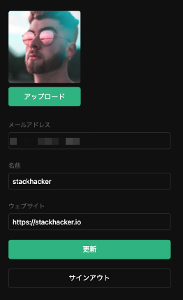
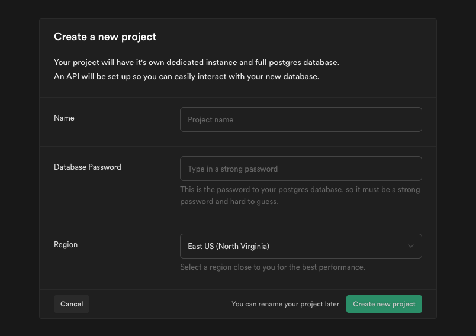
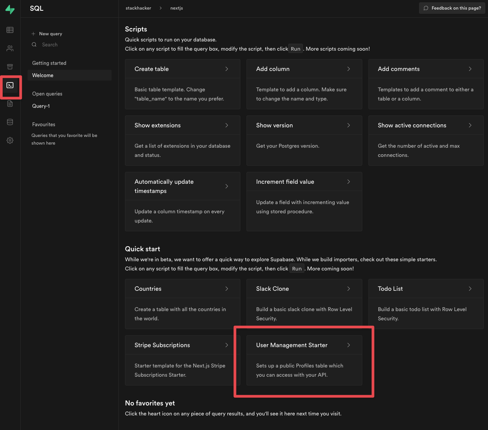
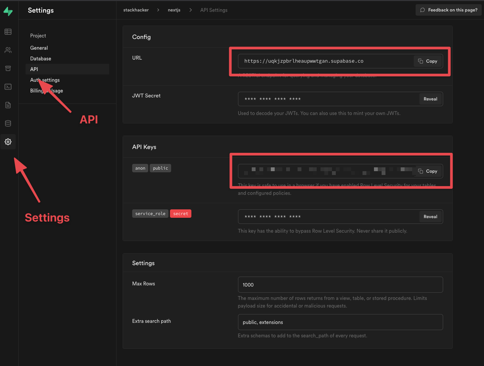

SupabaseとNext.jsを使って、ユーザがログインして、自身のプロフィールを編集できる、シンプルなアプリをゼロから構築する手順を紹介します。



Supabaseの下記の機能を使用します。

<!--
- Supabase [Database](/docs/guides/database): a Postgres database for storing your user data.
- Supabase [Auth](/docs/guides/auth): users can sign in with magic links (no passwords, only email).
- Supabase [Storage](/docs/guides/storage): users can upload a photo.
- [Row Level Security](/docs/guides/auth#row-level-security): data is protected so that individuals can only access their own data.
- Instant [APIs](/docs/guides/api): APIs will be automatically generated when you create your database tables.
-->
- [Database](https://supabase.io/docs/guides/database)：ユーザーデータを保存するためにPostgresデータベースを使用しています。
- [Auth](https://supabase.io/docs/guides/auth)：ユーザーはマジックリンクでサインイン（パスワードはなく、メールのみ）できます。
- [Storage](https://supabase.io/docs/guides/storage)：ユーザは画像をアップロードできます。

また、Supabaseは安心してすぐに使用することができます。

- [低レベルでのセキュリティー保護](https://supabase.io/docs/guides/auth#row-level-security)：PostgreSQLで自分のデータにしかアクセスできないようにデータを保護します。アプリケーションで心配する必要はありません。
- [APIs](https://supabase.io/docs/guides/api)：データベースのテーブルを作成すると、APIが自動的に生成されます。

本記事は、次の記事からコードと構成を参考にして構成しています。

<LinkCard href="https://supabase.io/docs/guides/with-nextjs" />

<!-- ## Project set up -->
## プロジェクト・セットアップ

<!--
Before we start building we're going to set up our Database and API. This is as simple as starting a new Project in Supabase 
and then creating a "schema" inside the database.
-->
構築を始める前に、データベースとAPIを設定します。Supabaseで新しいプロジェクトを立ち上げて、データベース内に「スキーマ」を作成します。

### プロジェクトを作成

<!--
1. Go to [app.supabase.io](https://app.supabase.io).
1. Click on "New Project".
1. Enter your project details.
1. Wait for the new database to launch.
-->
1. [app.supabase.io](https://app.supabase.io)にアクセス
1. 「New Project」をクリック
1. プロジェクトの詳細を入力



「Name」にプロジェクトの名称、「Database Password」にデータベース接続に使用するパスワードを入力します。「Region」には想定ユーザのネットワークに近いリージョンを選択します。「Northeast Asia (Tokyo)」もあります。

「Create new project」をクリックして、新しいデータベースが起動するまでしばらく待ちます。

<!--
### Set up the database schema
-->
### データベーススキーマの設定

<!--
Now we are going to set up the database schema. We can use the "User Management Starter" quickstart in the SQL Editor, 
or you can just copy/paste the SQL from below and run it yourself.
-->
次にデータベーススキーマの設定を行います。SQLエディタで「User Management Starter」のクイックスタートを使って作成します。

<!--
```sh
1. Go to the "SQL" section.
2. Click "User Management Starter".
4. Click "Run".
```
-->
1. 右メニューからSQLセクションを選択
1. 「User Management Starter」をクリック
1. 「Run」をクリック



<!--
### Get the API Keys 
-->
### APIキーの取得

<!--
Now that you've created some database tables, you are ready to insert data using the auto-generated API. 
We just need to get the URL and `anon` key from the API settings.
-->
データベーステーブルを作成したので、自動生成されたAPIを使ってデータを挿入する準備ができました。

APIの設定から、URLと`anon`キーを取得します。

<!--
```sh
1. Go to the "Settings" section.
2. Click "API" in the sidebar.
3. Find your API URL in this page.
4. Find your "anon" and "service_role" keys on this page.
```
-->

1. 「Settings」セクションに移動
2. サイドバーにある「API」をクリック



API URLとanonキーを確認します。後ほどアプリで使用します。

<!--
## Building the App
-->
## アプリの構築

<!--
Let's start building the Next.js app from scratch.
-->
それでは早速、Next.jsのアプリを一から作っていきましょう。

<!--
### Initialize a Next.js app
-->
### Next.jsアプリの初期化

<!--
We can use [`create-next-app`](https://nextjs.org/docs/getting-started) to initialize 
an app called `supabase-nextjs`:
-->
[`create-next-app`](https://nextjs.org/docs/getting-started)を使って、`supabase-next-js`というアプリを初期化します。

```shell {filename: shell}
npx create-next-app --use-npm supabase-nextjs
cd supabase-nextjs
```

<!--
Then let's install the only additional dependency: [supabase-js](https://github.com/supabase/supabase-js)
-->
次に、[supabase-js](https://github.com/supabase/supabase-js)をインストールします。

```shell {filename: shell}
npm install @supabase/supabase-js
```

<!--
And finally we want to save the environment variables in a `.env.local`. 
All we need are the API URL and the `anon` key that you copied [earlier](#get-the-api-keys).
-->
最後に、環境変数を `.env.local` に保存します。APIのURLと、先ほど保持した`anon`キーをセットします。

```bash {filename: .env.local}
NEXT_PUBLIC_SUPABASE_URL=SUPABASEのURL
NEXT_PUBLIC_SUPABASE_ANON_KEY=SUPABASEのANONキー
```

<!--
Now that we have the API credentials in place, let's create a helper file to initialize the Supabase client. 
These variables will be exposed on the browser, and that's completely fine since we have 
[Row Level Security](/docs/guides/auth#row-level-security) enabled on our Database.
-->
APIの認証情報で、Supabaseクライアントを初期化するヘルパーファイルを作成します。これらの変数はブラウザ上で公開されます。しかし、[低レベルでのセキュリティ保護](https://supabase.io/docs/guides/auth#row-level-security)がデータベース上で有効になっているので、全く問題ありません。

```js {filename: lib/supabaseClient.js}
import { createClient } from '@supabase/supabase-js'

const supabaseUrl = process.env.NEXT_PUBLIC_SUPABASE_URL
const supabaseAnonKey = process.env.NEXT_PUBLIC_SUPABASE_ANON_KEY

export const supabase = createClient(supabaseUrl, supabaseAnonKey)
```

<!--
And one optional step is to update the CSS file `styles/globals.css` to make the app look nice. 
You can find the full contents of this file [here](https://raw.githubusercontent.com/supabase/supabase/master/examples/react-user-management/src/index.css).
-->
アプリの見た目を整える場合、CSSファイル`styles/globals.css`を更新することでできます。

[こちら](https://raw.githubusercontent.com/stackhackerio/stackhacker.io/main/examples/supabase-nextjs-quickstart/styles/globals.css)のファイルで`styles/globals.css`を上書きしてください。

<!--
### Set up a Login component
-->
### ログインコンポーネントの設定

<!--
Let's set up a React component to manage logins and sign ups. 
We'll use Magic Links, so users can sign in with their email without using passwords.
-->
ログインやサインアップのReactコンポーネントを設定します。

ユーザーはパスワードを使用せずにメールでサインインできるように、マジックリンクを使用します。

```jsx {filename: components/Auth.js}
import { useState } from 'react'
import { supabase } from '../lib/supabaseClient'

export default function Auth() {
  const [loading, setLoading] = useState(false)
  const [email, setEmail] = useState('')

  const handleLogin = async (email) => {
    try {
      setLoading(true)
      const { error } = await supabase.auth.signIn({ email })
      if (error) throw error
      alert('ログイン・リンクをメールで確認してください！')
    } catch (error) {
      alert(error.error_description || error.message)
    } finally {
      setLoading(false)
    }
  }

  return (
    <div className="row flex flex-center">
      <div className="col-6 form-widget">
        <h1 className="header">Supabase + Next.js</h1>
        <p className="description">メールアドレスを入力してマジック・リンクでサインする</p>
        <div>
          <input
            className="inputField"
            type="email"
            placeholder="メールアドレス"
            value={email}
            onChange={(e) => setEmail(e.target.value)}
          />
        </div>
        <div>
          <button
            onClick={(e) => {
              e.preventDefault()
              handleLogin(email)
            }}
            className="button block"
            disabled={loading}
          >
            <span>{loading ? 'ローディング' : 'マジック・リンクを送る'}</span>
          </button>
        </div>
      </div>
    </div>
  )
}
```

<!--
### Account page
-->
### アカウントページ

<!--
After a user is signed in we can allow them to edit their profile details and manage their account.
-->
ユーザーがサインインした後、プロフィールの詳細を編集したり、アカウントを管理できるようにアカウントページを作成します。

<!--
Let's create a new component for that called `Account.js`.
-->
`Account.js`という新しいコンポーネントを作ります。

```jsx {filename: components/Account.js}
import { useState, useEffect } from 'react'
import { supabase } from '../lib/supabaseClient'
import Avatar from './Avatar'

export default function Account({ session }) {
  const [loading, setLoading] = useState(true)
  const [username, setUsername] = useState(null)
  const [website, setWebsite] = useState(null)
  const [avatar_url, setAvatarUrl] = useState(null)

  useEffect(() => {
    getProfile()
  }, [session])

  async function getProfile() {
    try {
      setLoading(true)
      const user = supabase.auth.user()

      let { data, error, status } = await supabase
          .from('profiles')
          .select(`username, website, avatar_url`)
          .eq('id', user.id)
          .single()

      if (error && status !== 406) {
        throw error
      }

      if (data) {
        setUsername(data.username)
        setWebsite(data.website)
        setAvatarUrl(data.avatar_url)
      }
    } catch (error) {
      alert(error.message)
    } finally {
      setLoading(false)
    }
  }

  async function updateProfile({ username, website, avatar_url }) {
    try {
      setLoading(true)
      const user = supabase.auth.user()

      const updates = {
        id: user.id,
        username,
        website,
        avatar_url,
        updated_at: new Date(),
      }

      let { error } = await supabase.from('profiles').upsert(updates, {
        returning: 'minimal', // Don't return the value after inserting
      })

      if (error) {
        throw error
      }
    } catch (error) {
      alert(error.message)
    } finally {
      setLoading(false)
    }
  }

  return (
    <div className="form-widget">
      <Avatar
        url={avatar_url}
        size={150}
        onUpload={(url) => {
          setAvatarUrl(url)
          updateProfile({ username, website, avatar_url: url })
        }}
      />
      <div>
        <label htmlFor="email">メールアドレス</label>
        <input id="email" type="text" value={session.user.email} disabled />
      </div>
      <div>
        <label htmlFor="username">名前</label>
        <input
          id="username"
          type="text"
          value={username || ''}
          onChange={(e) => setUsername(e.target.value)}
        />
      </div>
      <div>
        <label htmlFor="website">ウェブサイト</label>
        <input
          id="website"
          type="website"
          value={website || ''}
          onChange={(e) => setWebsite(e.target.value)}
        />
      </div>

      <div>
        <button
          className="button block primary"
          onClick={() => updateProfile({ username, website, avatar_url })}
          disabled={loading}
        >
          {loading ? 'ローディング...' : '更新'}
        </button>
      </div>

      <div>
        <button className="button block" onClick={() => supabase.auth.signOut()}>
          サインアウト
        </button>
      </div>
    </div>
  )
}
```

<!--
### Launch!
-->
### ページの作成

<!--
Now that we have all the components in place, let's update `pages/index.js`:
-->
これですべてのコンポーネントがそろったので、`pages/index.js`を編集します。

```jsx {filename: pages/index.js}
import { useState, useEffect } from 'react'
import { supabase } from '../lib/supabaseClient'
import Auth from '../components/Auth'
import Account from '../components/Account'

export default function Home() {
  const [session, setSession] = useState(null)

  useEffect(() => {
    setSession(supabase.auth.session())

    supabase.auth.onAuthStateChange((_event, session) => {
      setSession(session)
    })
  }, [])

  return (
    <div className="container" style={{ padding: '50px 0 100px 0' }}>
      {!session ? <Auth /> : <Account key={session.user.id} session={session} />}
    </div>
  )
}
```
<!--
Once that's done, run this in a terminal window:
-->
ターミナルでサーバーを実行します。

```shell {filename: shell}
npm run dev
```

<!--
And then open the browser to [localhost:3000](http://localhost:3000) and you should see the completed app.
-->
そして、ブラウザで`http://localhost:3000`を開くと、完成したアプリが表示されます。

<!--
## Bonus: Profile photos
-->
## プロフィール画像

<!--
Every Supabase project is configured with [Storage](/docs/guides/storage) for managing large files like 
photos and videos.
-->
すべてのSupabaseプロジェクトには、写真やビデオなどの大容量ファイルを管理するための[Storage](/docs/guides/storage)が設定されています。

<!--
### Create an upload widget
-->
### アップロード・ウィジェットの新規作成

<!--
Let's create an avatar for the user so that they can upload a profile photo. 
We can start by creating a new component:
-->
新しいコンポーネントを作成して、ユーザーがプロフィール画像をアップロードできるようにします。

```jsx {filename: components/Avatar.js}
import { useEffect, useState } from 'react'
import { supabase } from '../lib/supabaseClient'

export default function Avatar({ url, size, onUpload }) {
  const [avatarUrl, setAvatarUrl] = useState(null)
  const [uploading, setUploading] = useState(false)

  useEffect(() => {
    if (url) downloadImage(url)
  }, [url])

  async function downloadImage(path) {
    try {
      const { data, error } = await supabase.storage.from('avatars').download(path)
      if (error) {
        throw error
      }
      const url = URL.createObjectURL(data)
      setAvatarUrl(url)
    } catch (error) {
      console.log('Error downloading image: ', error.message)
    }
  }


  async function uploadAvatar(event) {
    try {
      setUploading(true)

      if (!event.target.files || event.target.files.length === 0) {
        throw new Error('You must select an image to upload.')
      }

      const file = event.target.files[0]
      const fileExt = file.name.split('.').pop()
      const fileName = `${Math.random()}.${fileExt}`
      const filePath = `${fileName}`

      let { error: uploadError } = await supabase.storage
          .from('avatars')
          .upload(filePath, file)

      if (uploadError) {
        throw uploadError
      }

      onUpload(filePath)
    } catch (error) {
      alert(error.message)
    } finally {
      setUploading(false)
    }
  }

  return (
    <div>
      {avatarUrl ? (
        
      ) : (
        <div className="avatar no-image" style={{ height: size, width: size }} />
      )}
      <div style={{ width: size }}>
        <label className="button primary block" htmlFor="single">
          {uploading ? 'アップロード中...' : 'アップロード'}
        </label>
        <input
          style={{
            visibility: 'hidden',
            position: 'absolute',
          }}
          type="file"
          id="single"
          accept="image/*"
          onChange={uploadAvatar}
          disabled={uploading}
        />
      </div>
    </div>
  )
}
```

<!--
### Add the new widget
-->
### ウィジェットの追加

<!--
And then we can add the widget to the Account page:
-->
新規作成したウィジェットをAccountコンポーネントに追加します。

```jsx {filename: components/Account.js}
// 新しく作成したウィジェットをimport
import Avatar from './Avatar'

// ...

return (
  {/* 応答する中身に追加 */}
  <div className="form-widget">
    <Avatar
      url={avatar_url}
      size={150}
      onUpload={(url) => {
        setAvatarUrl(url)
        updateProfile({ username, website, avatar_url: url })
      }}
    />
    {/* ... */}
  </div>
)

```

## おわりに

フロントをNext.jsで開発する際に、バックエンドのデータベース選びは、GraphQLベースであったり、NoSQL、CMSなど使いやすいサービスが豊富でどれを選択すればいいのかすごく悩みます。

SupabaseはPostgreSQLを使っており、個人的には馴染みも深いので安心感があります。SQLも使えるし、UIも充実していて、操作性がわかりやすくていいです。

SupabaseとStripeを使用してサブスクリプションをすぐにはじめられるスターターをご用意しています。ぜひご活用ください。

<LinkCard href="https://www.stackhacker.io/starters/astron" />
