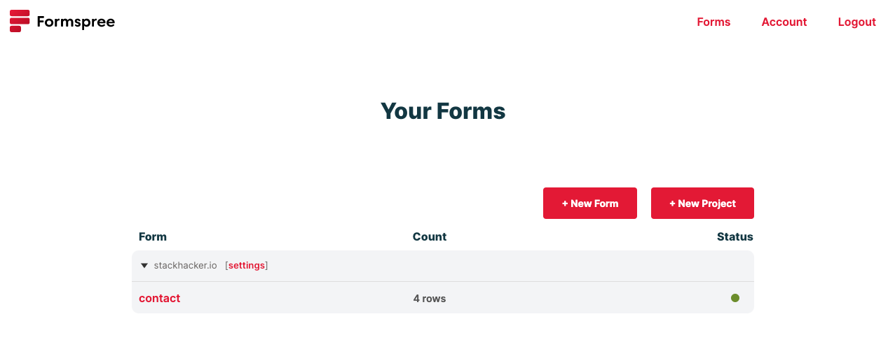
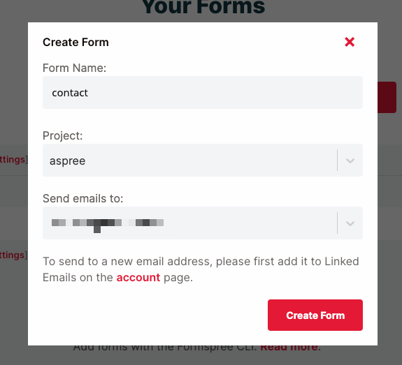
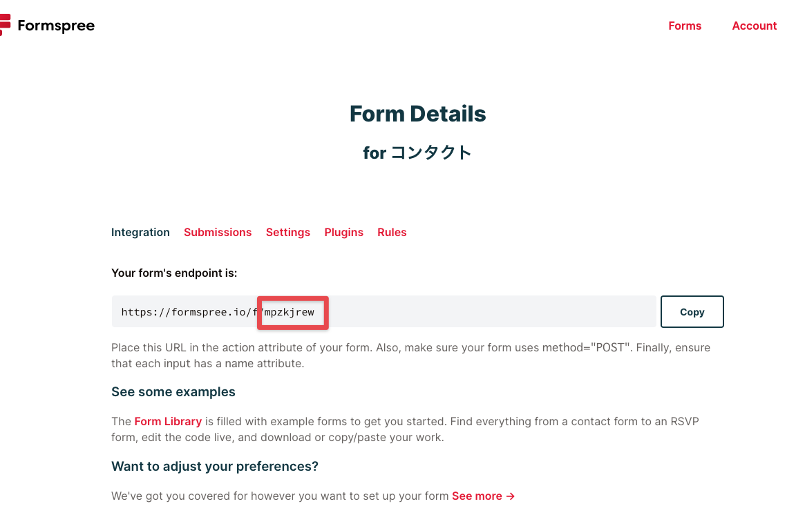
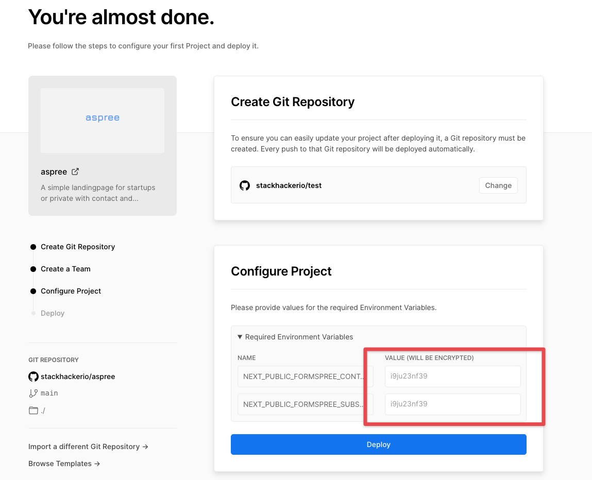

スタートアップや個人向けのシンプルなランディングページです。コンタクトフォームとニュースレター購読フォームがデプロイしてすぐにご利用いただけます。

## 特徴

フロントのテック・スタックは、Next.jsとTailwindcssをベースに構築しています。

- Next.js
- Tailwindcss
- wickedblocks
- Typescript
- next-seo

バックエンドには、Formspreeを使用し、フォームから投稿された内容をメールで受信したり、Slackに通知したり柔軟に設定できます。

## デモ

次のURLより、実際に動作しているサイトをご覧いただけます。

https://aspree.vercel.app/

## デプロイ

Formspreeのサインアップをして、フォームをコンタクト用と購読用の2つ作成します。

フォーム一覧から、**New Form**ボタンをクリックします。



**Form Name**には、**コンタクト**と入力して、**Project**に何か自身の適切なプロジェクト名を入力します。**Send emails to**には、アカウントを登録したメールが表示されるので、そのままにしておきます。必要事項を入力したら、**Create Form**をします。



作成されたフォームの詳細が表示されるので、フォームのエンドポイントからIDの部分を控えておきます。



同様に購読用のフォームを作成します。

以下のボタンをクリックして、vercelにデプロイします。

[](https://vercel.com/new/git/external?repository-url=https%3A%2F%2Fgithub.com%2Fstackhackerio%2Faspree&env=NEXT_PUBLIC_FORMSPREE_CONTACT_FORM_ID,NEXT_PUBLIC_FORMSPREE_SUBSCRIBE_FORM_ID&demo-title=aspree&demo-description=A%20simple%20landingpage%20for%20startups%20or%20private%20with%20contact%20and%20subscribe%20forms.&demo-url=https%3A%2F%2Faspree.vercel.app%2F&demo-image=https%3A%2F%2Faspree.vercel.app%2Fsite-image.jpg)

途中で、環境変数を入力します。



**VALUE**に先ほど控えたそれぞれのIDを入力します。

- NEXT_PUBLIC_FORMSPREE_CONTACT_FORM_ID: コンタクトフォームのID
- NEXT_PUBLIC_FORMSPREE_SUBSCRIBE_FORM_ID: 購読フォームのID

## カスタマイズ

### ローカルでの開発

デプロイが完了すると、自身のリポジトリにプロジェクトがコピーされるので、そのリポジトリをクローンします。関連パッケージをインストールして、サーバを起動します。

```sh
npm install
npm run dev
```

### SEO

SEOの管理を容易にするプラグインである、Next SEOが設定済みです。

<LinkCard href="https://github.com/garmeeh/next-seo" />

`next-seo.config.js`をご自身のサイトにあわせて編集してください。

### wickedblocks

Tailwindcssベースのwickedblocksで構築しているので、ブログなどお好みのパーツをコピー＆ペーストするだけで拡張することができます。

<LinkCard href="https://blocks.wickedtemplates.com/" />
