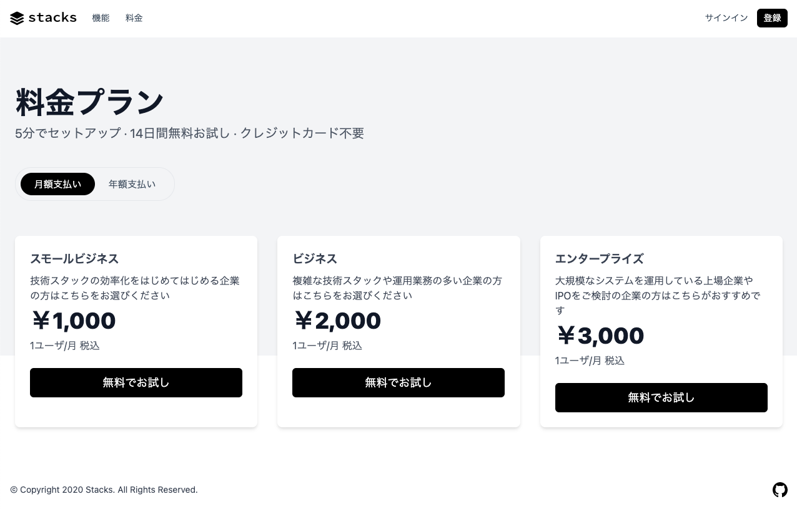
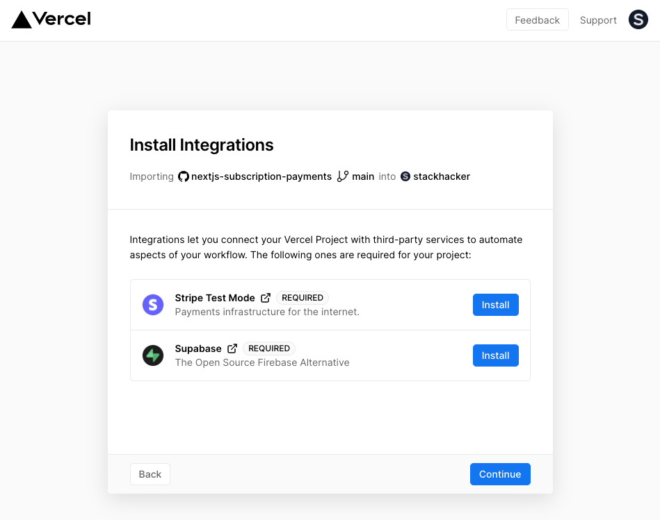

高性能なSaaSアプリケーションのためのオールインワンのスターターキットです。Next.jsの開発者は、数回クリックするだけで、独自のSaaSサブスクリプションアプリケーションをクローンし、デプロイできます。完全にカスタマイズできます。

vercelが提供している下記のスターターをベースにしています。

https://github.com/vercel/nextjs-subscription-payments

## 特徴

- [Supabase](https://supabase.io/docs/guides/auth)で安全なユーザー管理と認証を実現します。
- [Supabase](https://supabase.io/docs/guides/database)を使って、PostgreSQL上で強力なデータアクセス＆管理ツールを提供します。
- [Stripe Checkout](https://stripe.com/docs/payments/checkout)との統合、[Stripe customer portal](https://stripe.com/docs/billing/subscriptions/customer-portal)との統合、全ての配管がすでに設定されています。
- [Stripe webhooks](https://stripe.com/docs/webhooks)を介して、料金プラン、およびサブスクリプションのステータスを自動的に同期します。

本スターターでは、ベースにしているスターターの特徴に加えて下記の特徴があります。

- 完全日本語化
- Typescriptによる記述なので、IDEの強力な補完の恩恵が受けられます。
- [Kutty](https://github.com/praveenjuge/kutty/)を使用しているので、コンポーネントを柔軟に拡張できます。

## デモ

- https://nextjs-subscription-payments.stackhacker.vercel.app/



## アーキテクチャ


## Vercelにデプロイ

Vercelにデプロイする際、Supabaseのアカウントとプロジェクトの作成、Stripeのテストアカウントの作成が案内されます。StripeのWebhookエンドポイントを自動的に作成します。Supabase と Stripe インテグレーションのインストール後、関連するすべての環境変数が設定されるため、デプロイ後すぐにプロジェクトを使用できます。

<!-- TODO: vercel deploy button -->



プロジェクトがデプロイできたら、次の設定手順を進めてください。

## Supabase Authの設定

#### メールアドレス認証の設定

ユーザーが登録して、すぐサービスを使用できるようにしています。そのため、Supabaseのダッシュボードでメールアドレスの確認を無効にしてください。

Authenticationの**Settings**から、**General**の**Disable email confirmation**をオンにします。

#### OAuthプロバイダーの設定

GitHubの認証を追加するために、設定の概要を下記に示します。

まず、GitHubでOAuthアプリケーションを追加します。

- **Settings**ページから**Developer settings**を開きます
- **New OAuth App**でアプリケーション追加の入力画面を開きます

項目に下記の内容を入力します。

- Appliction name: アプリケーションの名称
- Homepage URL: ホームページURL（ない場合は、`http://localhost`などURLとして有効な値を入力します）
- Application description: アプリケーションの概要
- Authorization callback URL: 認証用のコールバックURL

認証用のコールバックURLは、Supabaseのダッシュボードより、**Settings**の**API**を開いて、**Config**の**URL**を参照して、`/auth/v1/callback`を追加します。下記の様な記述にあります。

https://xxxxxxxxxxxxxxx.supabase.co/auth/v1/callback

アプリケーションの追加が完了すると、**Client ID**と**Client secrets**が発行されます。

次に、Supabaseのダッシュボードより、**Authentication**から**Settings**を開いて、**GitHub enabled**をオンにします。先ほどの、**Client ID**と**Client secret**をそれぞれ入力して保存します。

- 商品1: ホビー
  - 価格1: 1,000円/月
  - 価格2: 10,000円/年
- 商品2: フリーランス
  - 価格1: 2,000円/月
  - 価格2: 20,000円/年

後述の**ローカルでの開発**をしていただくと、コマンドでサンプル価格を登録できます。

### Stripeカスタマーポータルの設定

1. [設定](https://dashboard.stripe.com/settings/branding)でブランディングを設定します。
1. [カスタマーポータルの設定](https://dashboard.stripe.com/test/settings/billing/portal)より下記を設定します。
  - 「顧客による支払い方法の更新を許可」をオン
  - 「顧客による低支払いのキャンセルを許可」をオン
  - 「顧客による別の料金プランへの変更を許可」をオン
  - 「商品」欄で変更を許可する製品と価格を追加
  - 必要なビジネス情報とリンクを設定

以上で、顧客から定期収入を得る準備が整いました。

## 本番稼動

本番稼働の前に、テストモードのStripe製品をすべてアーカイブしておきます。そうすることで、テストモードとライブモードの製品が混在しないようになります。ライブモードの商品を作成する前に、以下の手順でライブモードの`env vars`とwebhooksを設定してください。

プロジェクトをライブモードで実行し、Stripeで実際の支払いを処理するには、[Stripe Go Live](https://vercel.com/integrations/stripe-live)インテグレーションをプロジェクトに追加します。これにより、本番環境の環境変数としてライブ API キーと webhook のシークレットが設定されます。

その後、変更を有効にするため、本番環境のデプロイメントを再構築する必要があります。vercelのプロジェクトのダッシュボードで、**Deployments**のタブに移動し、最新の**Deployments**を選択して、メニューボタン（**Visit**ボタンの隣）をクリックし、**Redeploy**を選択します。

## ローカルでの開発

Vercel でデプロイすると、ローカルマシンにクローンできるリポジトリーが作成されます。

次に、[Vercel CLI](https://vercel.com/download)を使ってプロジェクトをリンクします。

```bash
vercel login
vercel link
```

### ローカルでの env vars の設定

Vercel CLIを使って、開発用のenv varsをダウンロードします。

```bash
vercel env pull .env.local
```

これにより、プロジェクトフォルダー内に新しい `.env.local`ファイルが作成されます。セキュリティー上の理由から、[Supabaseダッシュボード](https://app.supabase.io/)の**Settings**から**API**にある`SUPABASE_SERVICE_ROLE_KEY`を手動で設定する必要があります。

最後に、ウェブフックのシークレットは、ローカルでのテスト時とVercelにデプロイした場合で異なります。以下の手順で対応するWebhookシークレットを取得してください。

### Stripe CLIを使ってwebhookをテストする

まず[CLIのインストール](https://stripe.com/docs/stripe-cli)と[Stripeアカウントのリンク](https://stripe.com/docs/stripe-cli#login-account)を行います。

次に webhook の転送を開始します。

```bash
stripe listen --forward-to=localhost:3000/api/webhooks
```

CLIでは、webhookのシークレット（例えば、`whsec_***`）をコンソールに表示します。`.env.local` ファイルで `STRIPE_WEBHOOK_SECRET` をこの値に設定してください。

### 依存関係のインストールとNext.jsクライアントの実行

```bash
npm install
npm run dev
# または
yarn
yarn dev
```

### サンプルの価格登録

下記のコマンドでサンプルの価格を登録できます。

```
stripe fixtures fixtures/stripe.json
```
